# NBA Draft Model

### Motivation
In the summer of 2016, the NBA, equipped with a new $24-billion dollar TV contract, [experienced a drastic increase in its salary cap](https://www.si.com/nba/2016/07/02/nba-salary-cap-record-numbers-2016-adam-silver), the amount each team can spend on its total roster payroll. Teams, furnished with ample cap space with which to sign free agents, doled out exceedingly large and long-term contracts with the expectation that the cap would continue to increase at the same rate in future seasons. However, that expectation did not come to fruition and as a result has left a majority of teams facing the [luxury tax](https://en.wikipedia.org/wiki/Luxury_tax_(sports)) next season. To avoid future luxury tax payments, teams will be reliant on high-value or cost-controlled contracts to decrease payroll amounts, while still fielding competitive rosters. The majority of these high-value contracts will come in the form of [rookie-scale contracts](https://basketball.realgm.com/analysis/247867/CBA-Encyclopedia-Rookie-Scale-Contracts), which are pre-defined, and in most cases below market value, contracts that are given to players drafted in the first-round of the NBA draft.

With this in mind, the future success of many teams is reliant on their ability to select players in the NBA draft certain for NBA success. Aware of this, teams allocate significant resources toward the scouting and collection of intel on each draft prospect in hopes of increasing the probability that they select the correct player. My goal is to bring a machine learning approach to this same process by predicting which college players will perform best in the NBA. I seek to make projections for the upcoming 2017-18 draft class, while also discovering what player characteristics and on-court metrics are most predictive in identifying NBA success.

---

### Executive Summary
Built Gradient Boosting regression model, based on a player's college statistics, to predict their respective second-year NBA Value Over Replacement Player (VORP). Used these predications to rank college prospects in preparation for the 2017-18 NBA draft. Observed a test RMSE of 1.083, with the following players ranked in the top ten of the 2017-18 draft class.

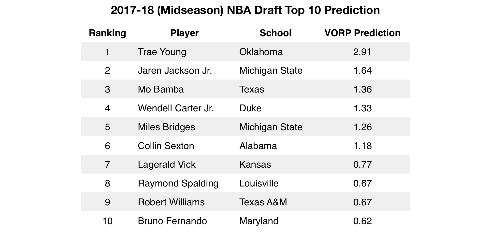

In my attempt to build a model that was robust to subjective positions, my model appears to have favored bigs over guards and wings. The majority of the most important features in the model, below, are metrics in which bigs on average outperform guards, such as percent of shots attempted at the rim, field goal percent at the rim, and a players weight. In future iterations, I plan to build a hierarchical model or separate models for guards, wings, and bigs to account for this.

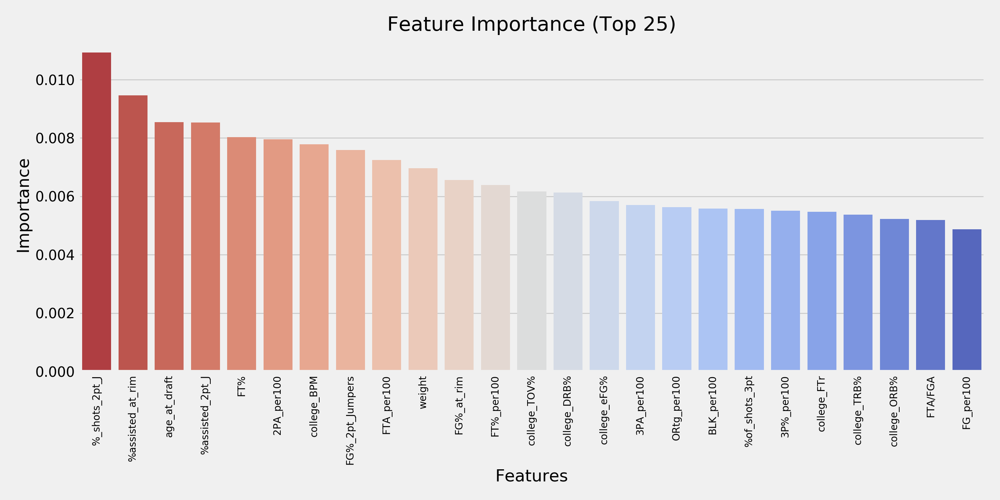

---

### Data Sources
While teams are privy to more in-depth information on prospects, I sought to utilize only publicly available data. In doing so, I aggregated descriptive information and on-court statistics from Sports-Reference.com, Basketball-Reference.com, and Hoop-Math.com. My final training and holdout data encompasses all players who played in college and were selected in the NBA Draft since 2012. A brief description of each source is provided below. Corresponding .csv files for each source, in addition to a data dictionary, is available in the data directory.

* **Meta Data**: Information pertaining to player characteristics such as height, weight, age, school, and conference.
* **College Per 100 Possession Statistics**: Box-Score statistics from each player's most recent college season, regularized to a per 100 possession level. This data accounts for variation in minutes played and pace of play for each player. (Sports-Reference.com)
* **College Advanced Stats**: Player statistics, from each player's most recent college season, that have been either regularized (i.e. OREB%) or engineered (i.e. Player Efficiency Rating). (Sports-Reference.com)
* **Shot Distribution Data**: More granular shooting statistics, from each player's most recent college season, which includes shot location and distributions.  (Hoop-Math.com)
* **NBA Advanced Stats**: Player statistics, from each player's second NBA season, that have been either regularized (i.e. OREB%) or engineered (i.e. Player Efficiency Rating). (Basketball-Reference.com)

A short aside on web-scraping, I ran into some trouble scraping certain tables from the family of Sports-Reference.com websites and wrote a useful tutorial on my solution [here](https://github.com/chrisfeller/Web_Scraping_Basketball_Reference).

---

### Target Variable Choice
To make projections for how well a player will perform in the NBA, I needed a metric to predict that encompassed a player's total production, efficiency, and contribution to team success. I considered two possible target variables, Box Plus-Minus (BPM) and Value Over Replacement Player (VORP). BPM is an estimate of the points per 100 possessions a player contributed above a league-average player, translated to an average team. VORP is a box score estimate of the points per 100 team possessions that a player contributed above a replacement-level (-2.0) player, translated to an average team and prorated to an 82-game season.

I also needed a timeframe on which to predict, for which I choose a player's second NBA season. While some players, like Shane Larkin who has found his way into the rotation in Boston this season, may be late bloomers and develop a successful career after their second season, most players have either established themselves as legitimate NBA players or are out of the league by year two. A player's second NBA-season also corresponds with the end of the guaranteed amount of their rookie-scale contracts. After year two, teams can [terminate a rookie-scale contract](https://sports.yahoo.com/news/front-office-insider-the-rookie-scale-option-143821675.html) by not exercising the following two seasons and thus move on from the player.

When I sorted my training data based on each potential target variable, in the table below, my subjective ranking of player value more closely aligned with the VORP ranking. With the exception of Terrence Jones, an argument could be made for each of the remaining 14 players that they are in fact one of the top 15 best players drafted since 2012. The same could not be said for multiple players such as Richaun Holmes and Mike Muscala that are present in the BPM ranking. From this, I selected a player's second-NBA season VORP as my final target variable.

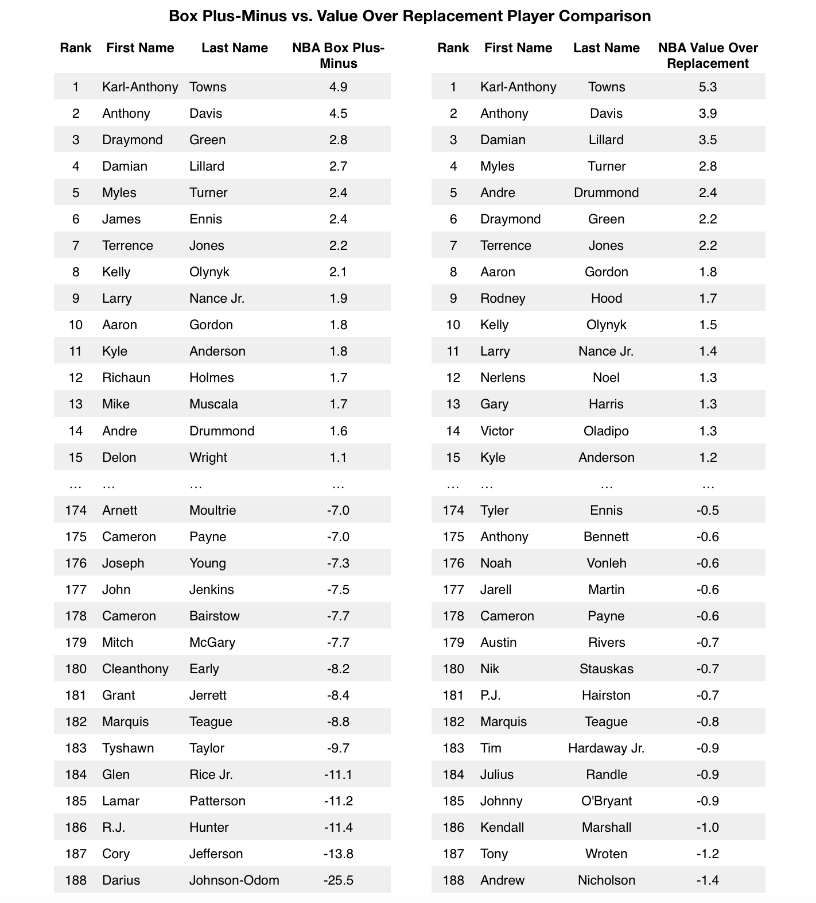

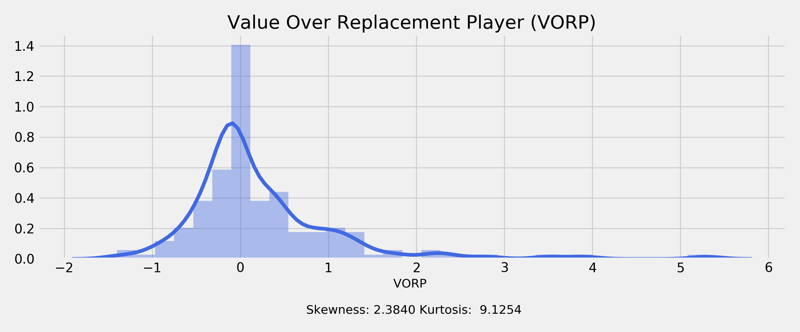

The distribution of VORP within my training data, appears relatively normal and centered around 0 based on the histogram above. However, former first overall picks Karl-Anthony Towns (5.3) and Anthony Davis (3.9) skew the data to the right tail as evidenced by the probability plot below. The distribution has a lower bound of -1.4 which makes intuitive sense since a replacement player, defined as a player that may be readily available in the G-League or free agency, has a value of -2.0. There are 30 nulls in my training data, which corresponds to 30 players who were drafted since 2012 and did not make it to a second season in the NBA.

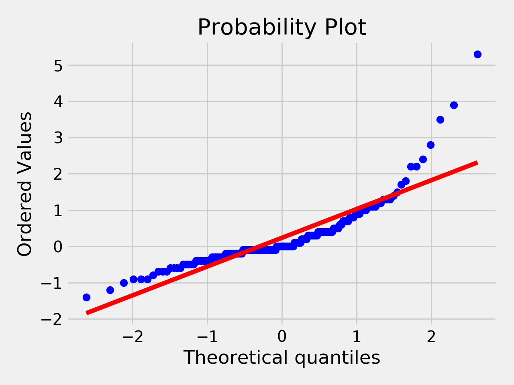

---

### Data Cleaning
To account for the 30 players who were drafted into the NBA, but never made it to their second NBA season, I imputed -2.0, the value for a replacement player, for their second-year VORP. Many of these players are the exact definition of a replacement player as most are still playing in the G-League or are current free agents available for signing by NBA teams.

After a few iterations of model testing, I discovered that the 10 players who played fewer than 50 minutes in their second NBA season were adding unnecessary noise into the data. To account for this, I imputed the minimum VORP (-1.4) in my training data for each of those 10 players. A comparison of my target variable before and after these imputations is included below. It is clear that the cleaned data now has a fatter left tail, which represents the 30 additional players now included in the distribution. The median VORP remains close to 0 after these imputations.

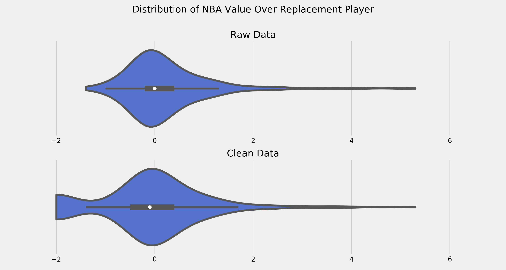

Lastly, a few centers had never attempted a three-point shot and thus had null values in their 3P%. Similarly, in the Hoop-Math shooting distribution data, there existed nulls represented by a '---' value. I imputed zero for these rare missing values.

---

### Exploratory Data Analysis

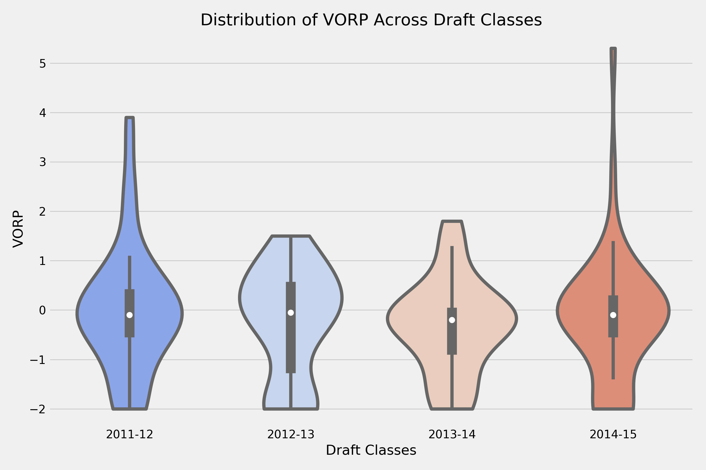

The violin plots above, represent the four draft classes in my training data (2012-2015). It is interesting to note the exceptional talent of Anthony Davis and Karl-Anthony Towns, evidenced by the upper bounds of the 2011-12 and 2014-15 plots. It is clear that the 2012-13 and 2013-14 drafts did not possess the same top-tier talent as the 2011-12 and 2014-15 drafts. The 2012-13 draft, which is generally considered as one of the worst draft classes of the last decade, has a similar or larger average VORP than the three other draft classes. The 2011-12 draft had the fewest busts, represented by the smallest lower tail, while the 2012-13 draft had the highest.

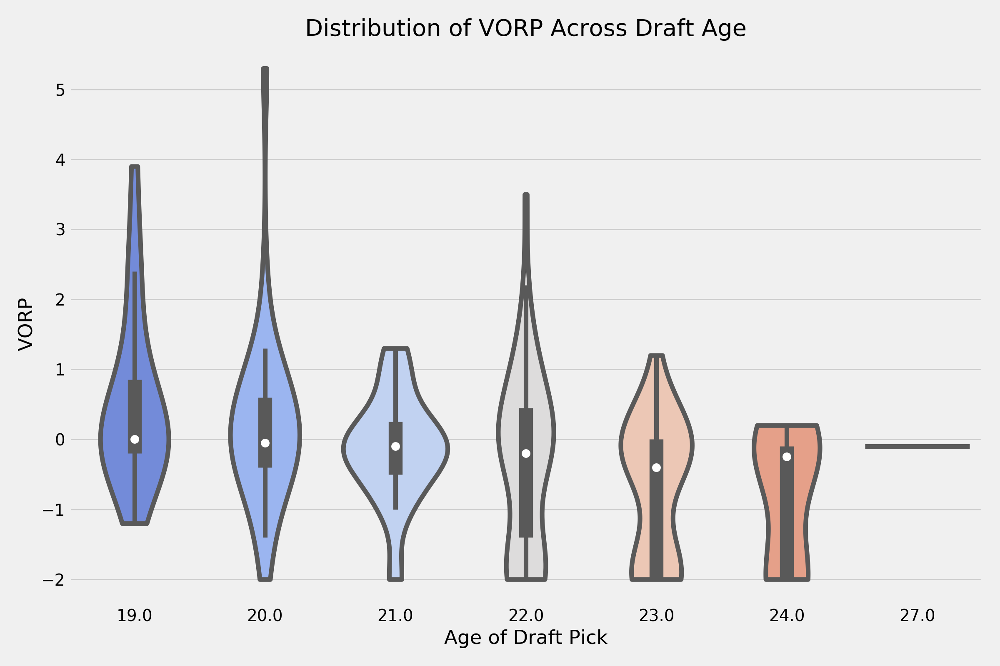

The violin plots above, represent the age in years of players drafted to the NBA between 2012 and 2015. There is a slight decline in the average second year VORP as the age of the player increases. There is also higher potential in younger draft selections, evidenced by the larger upper tails in the 19-20 age brackets. Conversely, there are far more busts in the 22-24 age brackets, evidenced by the thick lower tails. The 27 age bracket is represented, solely, by Bernard James who is the oldest player drafted into the NBA at the age of 27 years and 148 days.

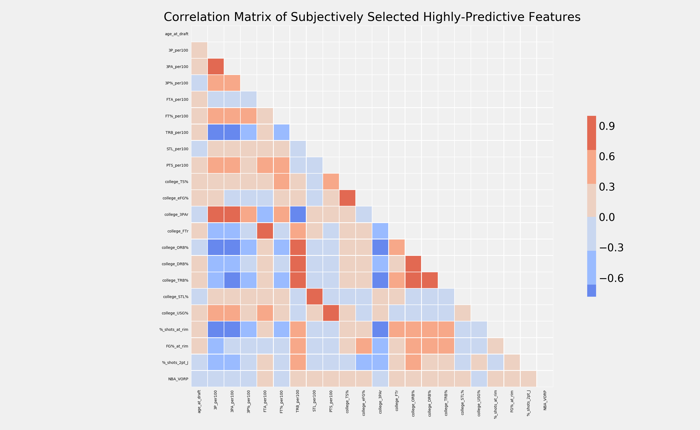

Based on the Examining Your Data chapter of *Multivariate Data Analysis* by Hair et al. (2013), I began examining my feature matrix by rating each feature either high, medium, or low for how I thought it would affect my target variable. This subjective practice allowed me to create a mental model based on my own experience working in the NBA and evaluating prospects, which I can refer to later for comparison purposes.

The correlation matrix above, represents all of the features I rated as being highly predictive of NBA success, in addition to the target variable NBA_VORP. Unsurprisingly, the age of a player was negatively correlated with VORP, while shooting statistics, such as eFG% and TS% were positively correlated with VORP. I also expect that college rebounding and steal statistics will be highly predictive of NBA success as they encompass the underlying variable of player length. We see that all of the rebounding and steals per 100 possessions are in fact positively correlated with VORP.

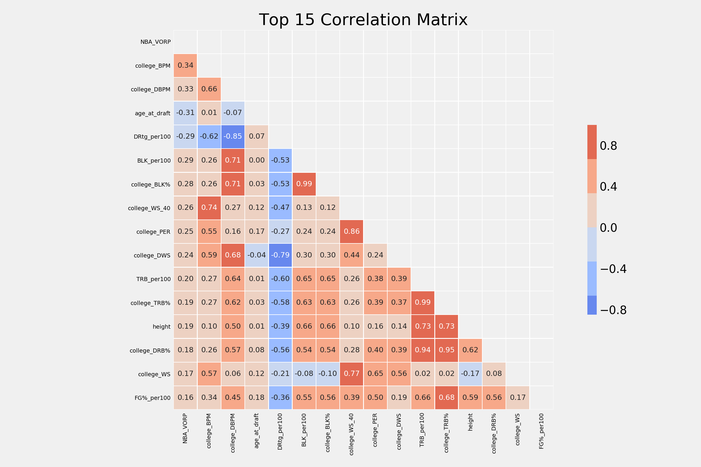

The correlation matrix above, includes the 15 features that were most correlated with the target variable NBA_VORP. In total, the feature matrix is composed of 89 features. With so many separate statistics to sort through and interpret, there have been attempts to feature engineer statistics that are all-encompassing of a player's ability. Box Plus-Minus, Player Efficiency Rating (PER), and Win Shares (WS) are three examples. We see that all three of these engineered features have a relatively strong relationship with NBA_VORP. These statistics have the potential to be useful in quick evaluation of a player as they encompass many underlying statistics and are widely understood in NBA scouting circles.

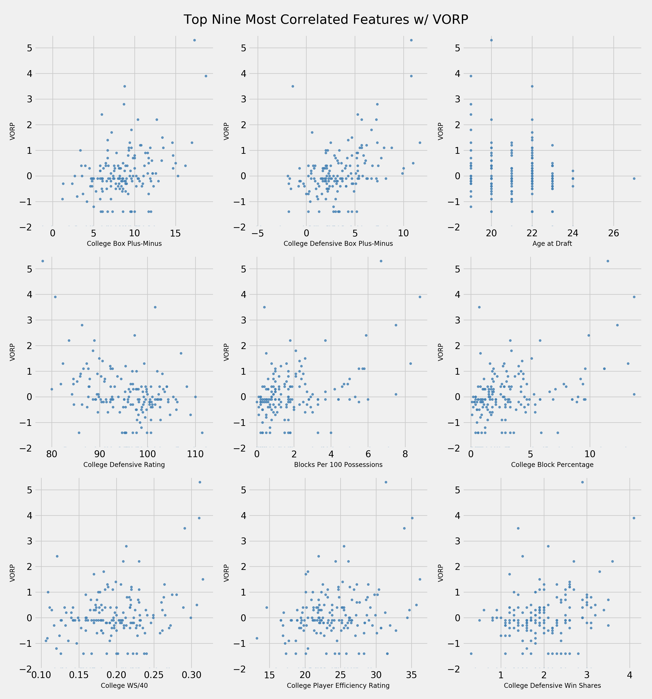

For a closer look at the relationship of the nine features that have the highest correlation with our target variable, I've included respective scatter plots above. A few features, such as College Box Plus-Minus, have a loose linear relationship with VORP, while others like College Win Shares, do not. My general expectation was that age would have had a far more linear relationship with VORP than is displayed in the training data.

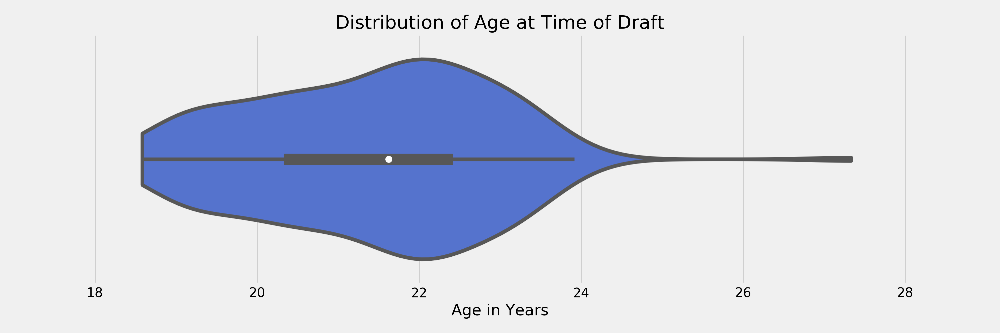

The range in age of drafted players in the training data is between 18.58 and 27.33 years. The median age is 21.62. The outlier in age is Bernard James who remains the oldest player ever drafted at 27 years and 148 days old.

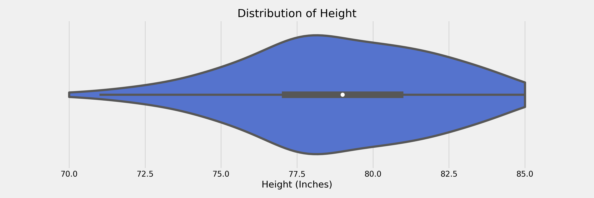

The height of drafted players in the training data ranges from Pierre Jackson who is 70 inches (5'10) to Alex Len, Meyers Leonard, and Alec Brown who are all 85 inches (7'1). The average height of drafted players in the training data is 78.9 inches (~6'7).

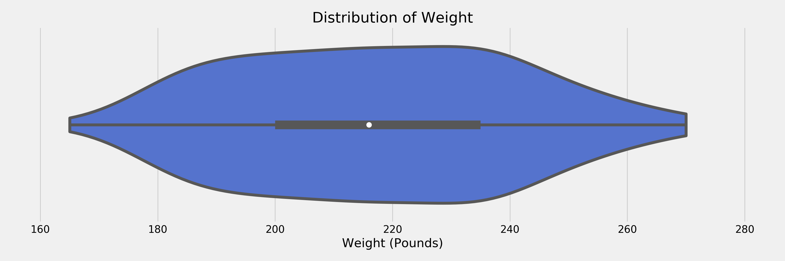

The distribution of weight is less interesting. It ranges from 165 to 270 pounds with the average being 217.

---

### Methodology
My general process started with the aggregation of data from four separate data sources into one feature matrix. I then split that data into training and holdout data sets, while cleaning the data in the process. I then performed a 75%/25% train/test split on my training data, which resulted in a training data set and a validation data set. Since my data was limited in size, I bootstrapped the training data to double the number of training observations I had. I then scaled my data by fit-transforming on my training data and transforming my validation and holdout data. Next, I performed a gridsearch on eight potential regression models using the training data to find optimized hyperparameters. With those optimized models, I then performed a 10-Fold Cross Validation on the training data to find the best performing model based on the metric Negative Mean Squared Error (MSE). After selecting my final model, I fit the model on the training data and made predictions for the validation data and holdout data.

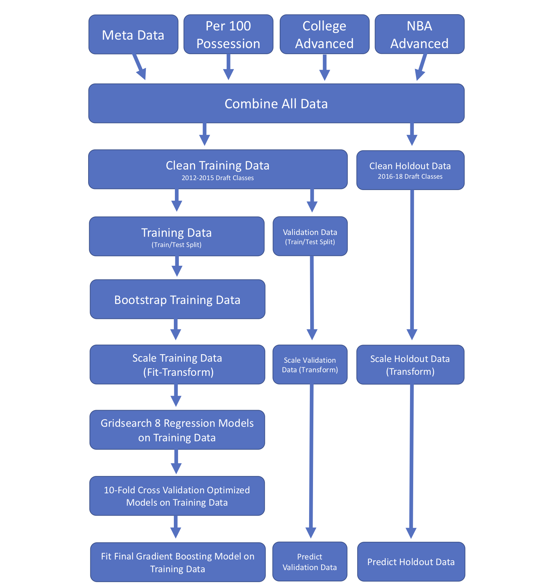

The three regularized regression models, Lasso, Ridge, and Elastic Net, performed poorly when compared to the other tree and ensemble-based models. Surprisingly, K-Nearest Neighbors performed very well, recording the second-highest cross validated score on the training data.

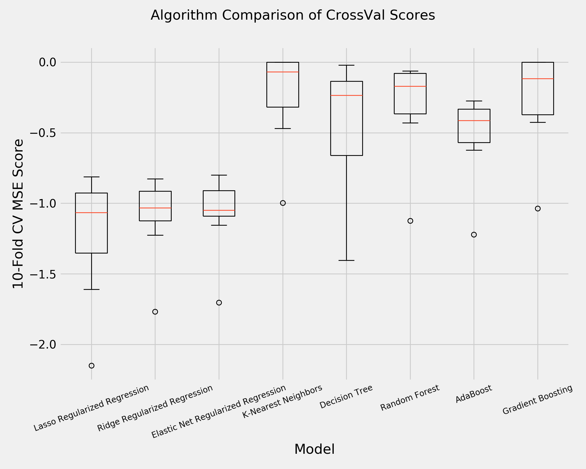

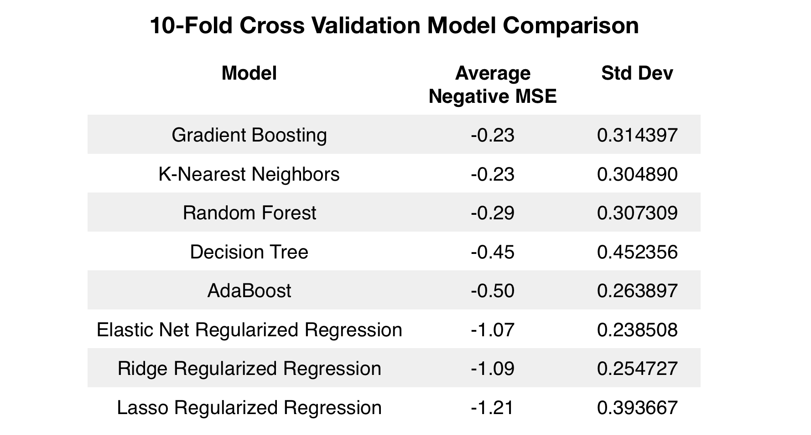

---

### Final Model
My final Gradient Boosting regression model was built using the following hyperparameters:
~~~
GradientBoostingRegressor(learning_rate=0.30000000000000004,
     loss='ls', max_depth=4, n_estimators=410, warm_start=False)
~~~
The model recorded an RMSE of 1.083 on the validation data with the following residuals. It appears the model performs better at the extremes. It does a better job of identifying the best and worst prospects, but is less reliable in the middle of the pack.

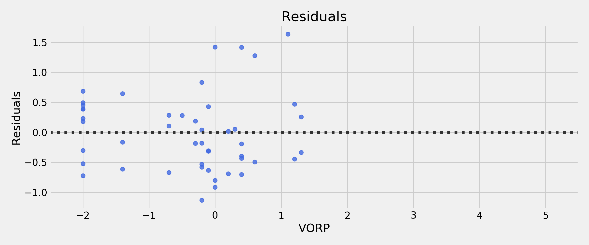

---

### Results

My predications for the validation data was a mixed bag. Few would select Richaun Holmes, Delon Wright, or K.J. McDaniels over Otto Porter. On the other hand, Otto Porter, Gary Harris, and Bobby Portis are all near the top, which matches my subjective rankings. Khris Middleton, Zach Lavine, and Devin Booker are certainly too low in the rankings. The general trend that I observe is that the model has over predicted bigs and under predicted wings and guards. The majority of the end of the list is made up of undersized guards.

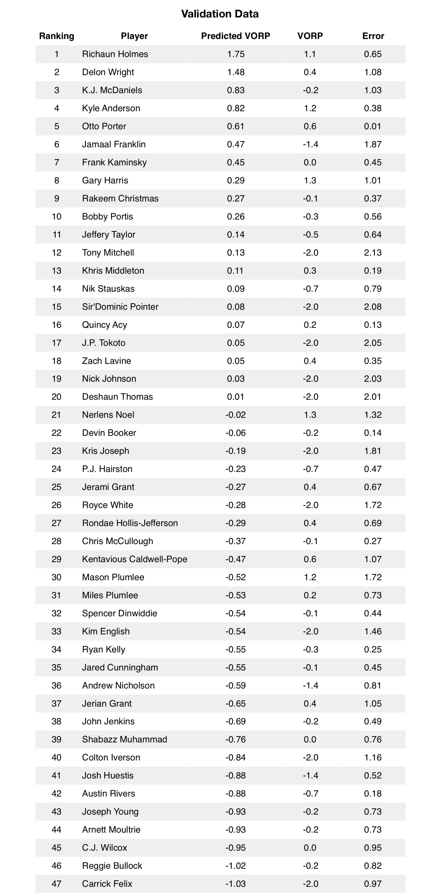

Of the two draft classes in the holdout data, the 2016-17 class is much more of a success story than the 2015-16 class. Top six draft selections Jayson Tatum, Josh Jackson, and Jonathan Isaac all appear in my top five projections. Further, Jordan Bell, who was selected 38th, and Donovan Mitchell, who was selected 13th, and are both widely considered steals in last year's draft, were ranked 13th and eighth, respectively in my model. Unfortunately, my first overall projected pick in the 2015-16 draft, Brice Johnson, has already had his third-year team option declined. Fellow projected lottery pick, Diamond Stone, has already been waived by both the Hawks and Bulls.

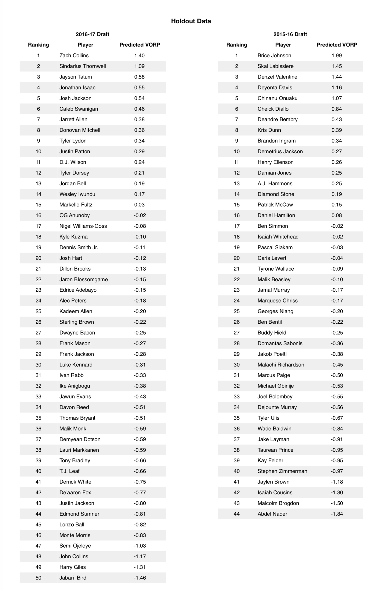

All potential prospects for the 2017-18 NBA Draft are based off the latest mock drafts from [Draft Express](http://www.espn.com/nba/insider/story/_/id/21590899/2018-nba-mock-draft-picks-chicago-bulls-cleveland-cavaliers-philadelphia-76ers)
and [Sam Vecenie ](https://theathletic.com/205405/2018/01/08/2018-nba-mock-draft-doncic-and-ayton-emerge-as-1a-and-1b/) as I consider theirs to be the premier public draft analyses. Michael Porter Jr. and Mitchell Robinson have been excluded from consideration as they've not yet recorded any meaningful NCAA statistics. I used De'Anthony Melton and Austin Wiley's 2016-17 stats since they've yet to be cleared for play this season by the NCAA.

While still very early, I was relatively encouraged by these results. Seven players in this top 10 have a legitimate chance of being selected in the top ten picks of this year's NBA Draft. However, the absence of Deandre Ayton and Marvin Bagley is a warning sign. Daniel Gafford, from Arkansas, is someone that ranks higher in my projections (16) than most draft boards right now but in my opinion actually has the potential to rise up into the mid- to late first round. I think the same could be said for Khyri Thomas (26) and Chandler Hutchison (29). While 19 is probably too high for Jalen Brunson, I think a team will get good value for him sometime in the early second round as a long-term backup point guard. Keita Bates-Diop (49) and Grayson Allen (63) are certainly too low in my rankings, which is probably a result of their age with each player being a ripe 22 years old. My model may over value age just a tad.

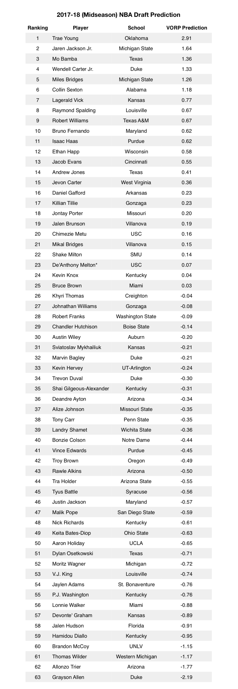

### Next Steps
My original goal was to build a model that was robust to subjective positions, such as point guard and power forward. After examining the feature importances of my final model and the predictions themselves, it appears that my model favors bigs over guards and wings. To account for this, my next step is to build a hierarchical model or separate models for guards, wings, and bigs.

Separately, I chose to use all draft classes since 2012 as my training data since the granular shooting data from Hoop-Math.com only goes back that far. I would like to build a similar model as explained in this readme, utilizing only Per 100 Possession and College Advanced data for the past 15 draft classes. Hopefully, the choice for more observations and fewer features will result in better predictions.

### References

1) Golliver, Ben. *NBA announces record salary cap for 2016-17 after historic climb*   
https://www.si.com/nba/2016/07/02/nba-salary-cap-record-numbers-2016-adam-silver
2) Leroux, Danny. *CBA Encyclopedia: Rookie Scale Contracts*
https://basketball.realgm.com/analysis/247867/CBA-Encyclopedia-Rookie-Scale-Contracts
3) Marks, Bobby. *Front-Office Insider: Rookie-scale options*
https://sports.yahoo.com/news/front-office-insider-the-rookie-scale-option-143821675.html
4) Hair et al. (2013). *Multivariate Data Analysis*
http://www.mypearsonstore.com/bookstore/multivariate-data-analysis-9780138132637
5) Givony, Jonathan. *NBA mock draft: Best picks for Bulls, Cavs, 76ers and more*
http://www.espn.com/nba/insider/story/_/id/21590899/2018-nba-mock-draft-picks-chicago-bulls-cleveland-cavaliers-philadelphia-76ers
6) Vecenie, Sam. *2018 NBA Mock Draft: Doncic and Ayton emerge as 1A and 1B*
https://theathletic.com/205405/2018/01/08/2018-nba-mock-draft-doncic-and-ayton-emerge-as-1a-and-1b/

### Acknowledgments
Special thanks to my Galvanize Data Science Immersive instructors [Elliot Cohen](https://github.com/Ecohen4), [Frank Burkholder](https://github.com/Frank-W-B), and [Adam Richards](https://github.com/ajrichards). Additional thanks to our Data Science Resident Instructor, [Kristie Wirth](https://github.com/kristiewirth). Lastly, thanks to [Matt Frederick](https://github.com/comma3) for the code review and to [JP Wright](https://github.com/jp-wright) for uncovering the Basketball-Reference web scraping problem.
