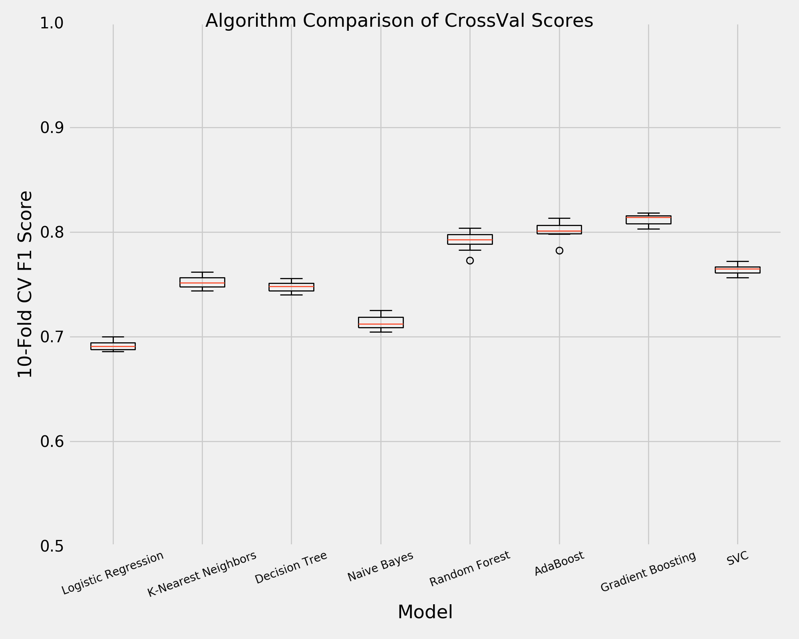
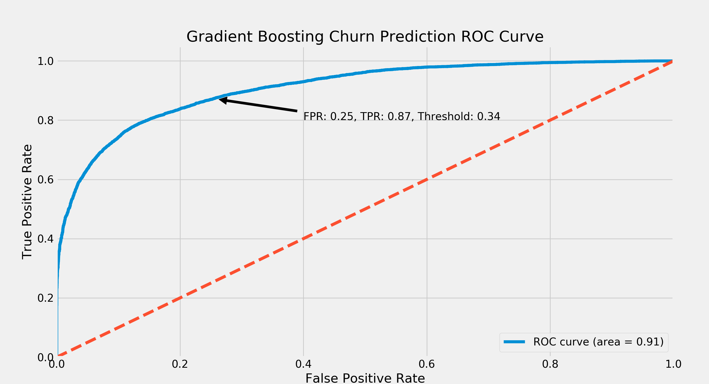

# Churn Prediction Case Study

Built Gradient Boosting model to predict churn for a ride-sharing company in San Francisco. Predicting the likelihood of churn based on user profiles in order to provide suggestions to improve user retention. Since the data is sourced from a real company, I've not shared the dataset or specific suggestions.

## Business Problem
A ride-sharing company (Company X) is interested in predicting rider retention. To help explore this question, they have provided a sample dataset of a cohort of users who signed up for an account in January 2014. The data was pulled on July 1, 2014; they consider a user retained if they were “active” (i.e. took a trip) in the preceding 30 days (from the day the data was pulled). In other words, a user is "active" if they have taken a trip since June 1, 2014.

They would like you to use this data set to help understand what factors are the best predictors for retention, and offer suggestions to operationalize those insights to help Company X. Therefore, your task is not only to build a model that minimizes error, but also a model that allows you to interpret the factors that contributed to your predictions.

Here is a detailed description of the data:
~~~
city: city this user signed up in
phone: primary device for this user
signup_date: date of account registration; in the form `YYYYMMDD`
last_trip_date: the last time this user completed a trip; in the form `YYYYMMDD`
avg_dist: the average distance (in miles) per trip taken in the first 30 days after signup
avg_rating_by_driver: the rider’s average rating over all of their trips
avg_rating_of_driver: the rider’s average rating of their drivers over all of their trips
surge_pct: the percent of trips taken with surge multiplier > 1
avg_surge: The average surge multiplier over all of this user’s trips
trips_in_first_30_days: the number of trips this user took in the first 30 days after signing up
luxury_car_user: TRUE if the user took a luxury car in their first 30 days; FALSE otherwise
weekday_pct: the percent of the user’s trips occurring during a weekday
~~~

### Data Cleaning

First, we modified both date features to be of datetime dtypes. We then created an 'Active' feature to identify if a user had used the ride-share company within the previous 30 days ("active" if they have taken a trip since June 1, 2014).

Next, we imputed the median 'avg_rating_by_driver' and median 'avg_rating_of_driver' for missing observations in those features. We dropped any observations with a null value in the 'phone' feature. We made dummy variables for 'city', 'luxury_car_user', and 'phone.' Finally, we standardized all continuous variables.

### Imbalanced Classes
After cleaning the data, we were left with 13 features and 39,681 observations. It is important to note that our target vector 'Active' is imbalanced with only a small portion actually churning. To handle this, we utilized SMOTE over-sampling technique to create balanced classes.

### Model Selection

After performing a test/train split on the training data, we cross-validated with the following vanilla models.

| Model  | Avg. Accuracy  | Std. Dev.  |
|---|---|---|
| Logistic Regression  | 0.69  | 0.004310  |
| K-Nearest Neighbors  | 0.75  | 0.005674  |
| Decision Tree  | 0.75  | 0.004691  |
| Naive Bayes  |  0.71 | 0.006518  |
| Random Forest  | 0.79  | 0.008541  |
| AdaBoost  | 0.80  | 0.008114  |
| Gradient Boosting  | 0.81  | 0.005011  |
| SVC  | 0.76  | 0.037898  |
| Average of all  | 0.759  |   |

We then grid searched for optimal hyper-parameters on the top three performing models (Gradient Boosting, AdaBoost, and Random Forest). When cross validated on the training set of the test/train split, the optimized Gradient Boosting performed the best. Thus, our final model was build using the following parameters:
~~~
Best Params: {'learning_rate': 0.25, 'max_features': None,
'min_samples_leaf': 100, 'n_estimators': 90}
~~~

### Final Results

When tested on the validation set of the train/test split on the training data, the Gradient Boosting model mentioned above recorded an f-score of 0.823. It also produced the ROC Curve found below. On the actual test data, it recorded an f-score of .7920.

