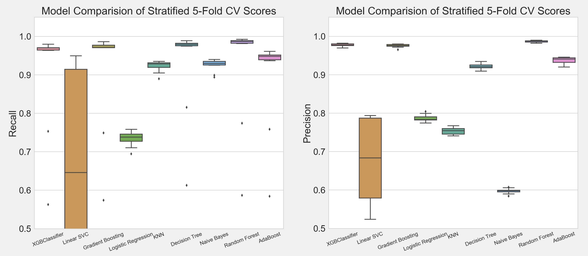

# Fraud Detection Case Study
Created a web-based app, which pulls in streaming data from an e-commerce website. That data is then run through a Random Forest Classifier to predict whether a certain posting is fraudulent. The resulting prediction is saved to a MongoDB and displayed on the web-app.

### Business Problem
A startup e-commerce website is trying to weed out fraudsters. You are tasked with developing and deploying a model to predict which posts on the website are fraudulent. The final product should be a web-based app, which displays predictions for newly created web postings. Since the data is sourced from a real company, I've not shared the dataset.

### Data Cleaning
A training dataset of over 14,000 labeled (fraud or not fraud) web postings on the e-commerce website were provided. We began by filtering out features that contained unrelated or uninformative information. While many of the remaining features were completely clean, we imputed missing values in the has_header feature and then dropped the remaining 2% of observations that contained any null values. Next, we created dummy variables for all of the categorial features. Lastly, since only ~14% of our training data was fraudulent, we utilized SMOTE oversampling to account for the imbalanced classes in our model fitting.  

### Exploratory Data Analysis
* Only four features in the feature matrix were positively correlated with fraud.
* Postings with a User Type equal to 1 had a much higher probability of being fraudulent.
* Postings that transacted with US Dollars had a higher occurrence of fraud than those that transacted in the pound or Canadian Dollar.
* Postings that utilized a delivery method of 0 had a significantly higher probability of being fraudulent.
* The mean age of fraudulent postings was lower than that of non-fraudulent postings.  

### Model Selection
We ran a 5-Fold Stratified Cross Validation on the following nine classification models with our training data. Of the five metrics we used to evaluate model efficacy, Random Forest performed best or tied for the highest score in all five.

### Final Results
After gridsearching for optimized parameters with our final Random Forest Classifier, our final model is displayed below:
~~~
RandomForestClassifier(bootstrap=True, criterion='entropy',  
                       max_depth=None, max_features=10,  
                       min_samples_leaf=1, min_samples_split=2,
                       n_estimators=25)
~~~

The model resulted in the following ROC Curve:

### Flask Web App
Our flask app pulls in a new posting from the e-commerce website every 30 seconds and runs it through our final Random Forest model. The resulting prediction of whether the posting is fraudulent is displayed along with the description of the respective posting. An example screenshot is provided below:

#### Collaborators
* [Paul Drabinski](https://github.com/pdrabinski)
* [Sarah Lewis](https://github.com/sgreylewis)
* [Louis Rivera](https://github.com/louisrivera)
