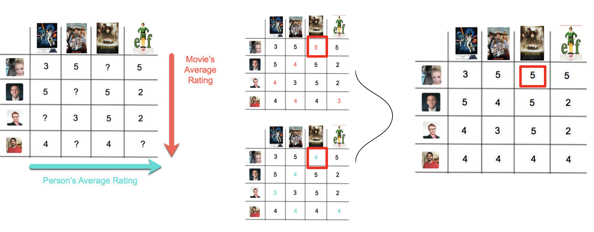
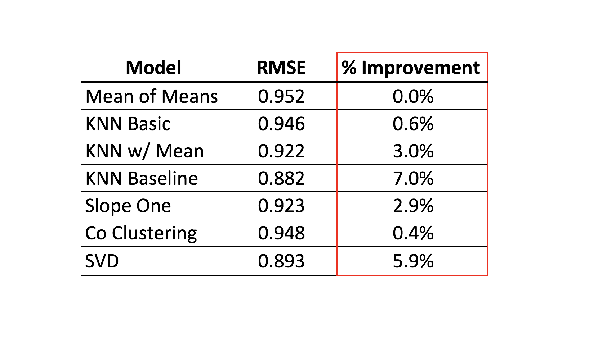
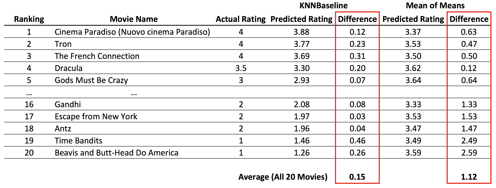
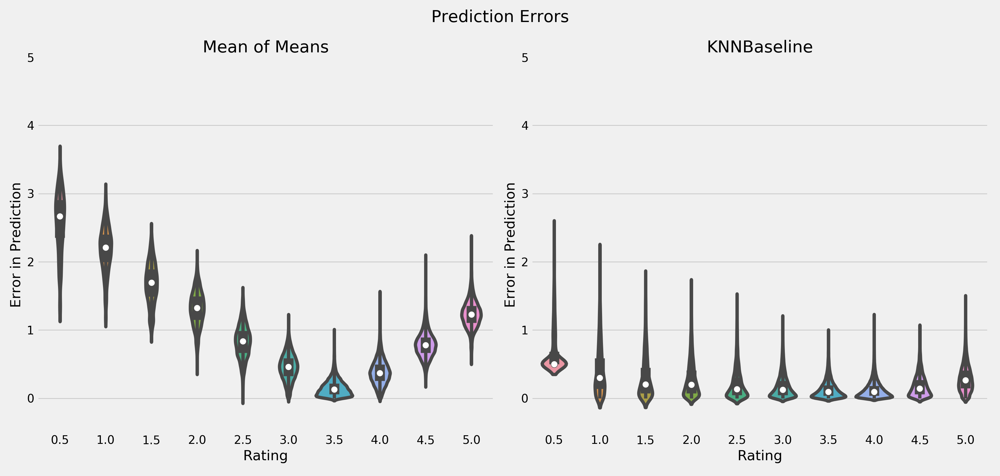

# Recommender Case Study

Built recommender system utilizing [surpriselib](http://surpriselib.com/) to improve upon existing recommender for video-streaming service. Final KNNBaseline recommender improved upon the existing recommender's RMSE by 7.0%.

### Business Problem
You are working for a video-streaming service who uses several production recommenders that provide a significant revenue stream. The issue is that these systems have been around a long time and your head of data science has asked you and your team members to explore new solutions. The main goal here is to improve the RMSE, however, another equally important goal is to present your model and the details of your methods in a clear, but technically sound manner.

### Original Model
The service's current recommender, which you will use as your baseline, is called Mean of Means. It attempts to predict a user's rating for an unseen movie by averaging the global mean rating, the user's mean rating, and the movie's mean rating. The code for the existing Mean of Means model can be found in `baseline_recommender.py`. An example of the model is included below.

##### Mean of Means Example

### Model Selection
We began by gridsearching to find the optimal parameters for the following six models. We then performed 3-Fold Cross-Validation on each model with its best parameters, which resulted in the following table. KNN Baseline, our best performing model, improved upon the existing Mean of Mean's RMSE by 7.0%.

### Final Model

To provide a concrete example of the improvement in recommendations that our model produces, we examine the first user in our existing ratings database. This user has rated 20 movies, which we've displayed below, ranked in descending order based on their ratings. The 'Difference' column displays the difference, or error, between the model's predicted rating and how the user actually rated the movie. The existing Mean of Means recommender produces an average difference of 1.12, while our new KNNBaseline recommender's average difference is only 0.15.

When examining the distribution of errors between models, we see that the KNNBaseline recommender is far superior at predicting movie ratings at each spectrum of the rating scale. While the Mean of Means performs relatively well when predicting a rating of 3.0 and 3.5, it does a poor job of predicting ratings of 0.5 and 5.0. In contrast, KNNBaseline recommender performs equally well across all ratings between 0.5 and 5.0.

#### Acknowledgements
Thanks to [Nicolas Hug](https://github.com/NicolasHug/Surprise) for surpriselib, particularly [this jupyter notebook on building a pandas dataframe from surprise predictions](https://github.com/NicolasHug/Surprise/blob/48621350b760c105ce5953f9253380caf9cb8982/examples/notebooks/KNNBasic_analysis.ipynb).

#### Collaborators
[Leo Walker](https://github.com/leowalker89)
[Nicki Rahm](https://github.com/NRahm)
[Daniel Meurer](https://github.com/DataDanD)
