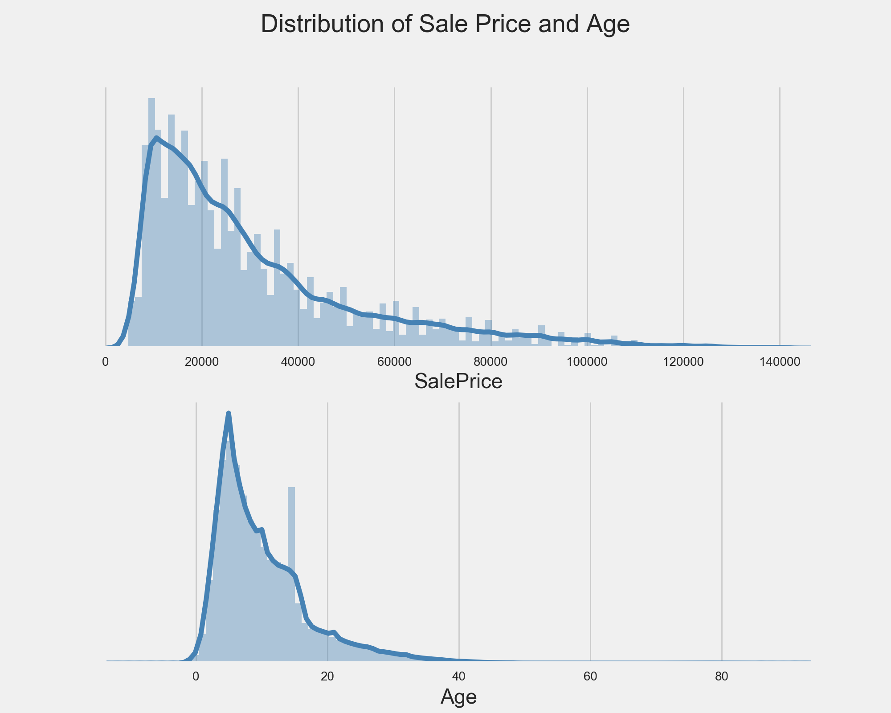
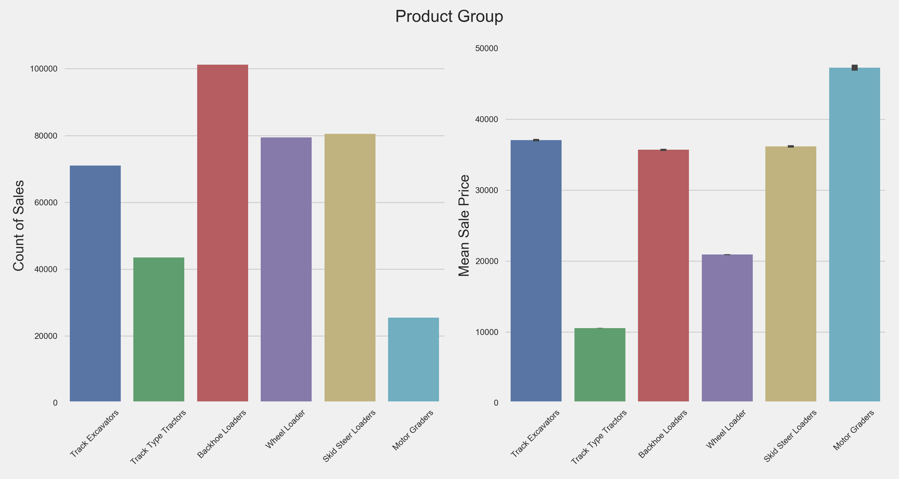
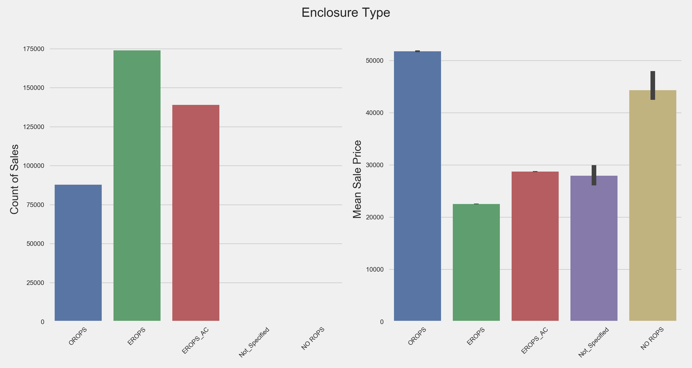
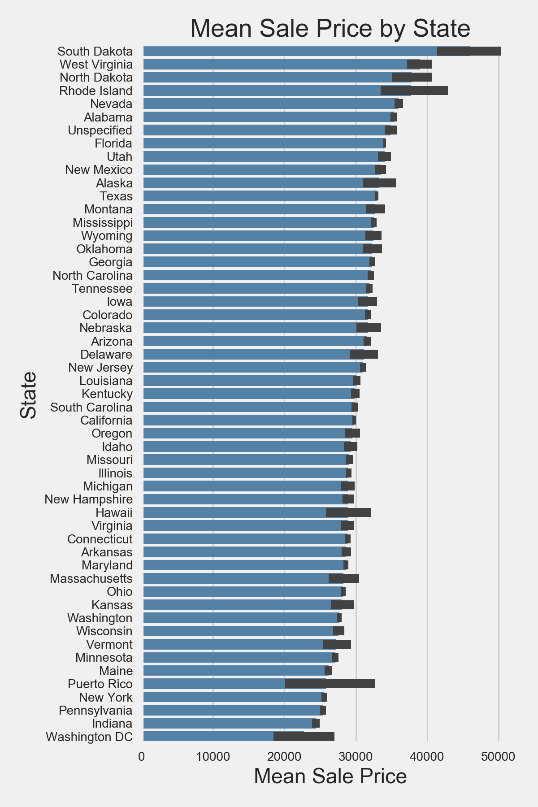

# Regression Case Study

Utilized ridge regression to predict the sale price of a particular piece of heavy equipment at auction based on it's usage, equipment type, and configuration.

### Data Cleaning

A sparse and messy dataset, our original training data involved 53 features and 401,125 observations. Many of the features contained mixed datatypes and/or were predominantly composed of null values.

Our first step was to drop any feature made up of 25% or more null values, in addition to features we flagged as insignificant or duplicate based on their description in the provided data dictionary. Next, we converted features to their correct datatypes. After observing the distributions of the data, we noticed there was one specific outlier, a piece of equipment made in the year 1000. We replaced this outlier with the median year in which all equipment was made. Most importantly, we created an Age feature to express the time between the date in which it was originally sold and the date during which it was put up for auction. Lastly, we created dummy variables for all of our categorical features.

### Exploratory Data Analysis

Once our data was in a more consumable form, we wanted to look at how the sale price of underlying equipment groups varied. First, we observed the distribution of SalePrice and Age, each of which were right skewed.

To see how SalePrice varied between the different product groups, we looked at the number of sales and the mean sale price for each group. Motor Graders had the highest mean sale price, while accounting for the fewest number of sales. Conversely, Backhoe Loaders were the most frequently sold group, but their mean selling price was around the average selling price of all equipment.

Next, we observed similar trends with the type of cabin enclosure each machine possessed. Open Roll Over Protective Structure (OROPS) were less common than other types, but went for a much higher mean selling price. Counter to our intuition, enclosures with air conditioning did not demand the highest mean selling price.

Lastly, we were curious if the location of the auction had an effect on sale price. This came in handy when we later examined our coefficients in the final model.

### Model Selection

After standardizing the cleaned data, we gridsearched on Ridge, Lasso, and ElasticNet regularization models. Based on the MSE of each optimized model, displayed below, we decided to utilize a ridge regression as our final model.

~~~
Lasso: Best Params: {'alpha': 0.5}, Best Score: 295510459.126
Ridge: Best Params: {'alpha': 1.0, 'solver': 'svd'}, Best Score: 294933308.122
Elastic: Best Params: {'alpha': 0.52105263157894732, 'l1_ratio': 1.0}, Best Score: 296362713.329
~~~

When tested on the validation set of our training data, our model recorded an MSE of 294,285,725.692 and RMSLE of 0.5635.

### Final Results

When run on our test data, the model recorded an MSE of 392,317,018.092 and RMSLE of 0.635. In terms of interpreting coefficients, we've included the top 15 below. Our initial intuition that the product group would heavily influence the sale price was correct, with the Motor Graders having the largest positive coefficient. Similarly, the state in which the equipment was auctioned played a deciding factor in the price, with North Dakota, South Dakota, and Alaska all positively influencing the selling price. Counter to our finding in the EDA section, cabin enclosures with air conditioning demanded a much higher selling price.

| Feature  | Coefficient  |
|---|---|
| ProductGroupDesc_Skid Steer Loaders  | -20419.787  |
| ProductGroupDesc_Motor Graders  | 19575.555  |
| Enclosure_EROPS_AC  | 12903.468  |
| ProductGroupDesc_Backhoe Loaders  | -9877.754  |
| Enclosure_NO ROPS  | 8695.025  |
| Enclosure_OROPS  | -8586.548  |
| state_Washington DC  | -8504.095  |
| Enclosure_Not_Specified  | -8499.922  |
| ProductGroupDesc_Track Type Tractors  | 8432.799  |
| Age  | -7780.675  |
| state_Alaska  | 6410.301  |
| state_North Dakota  | 6386.752  |
| state_Puerto Rico  | -6298.611  |
| state_South Dakota'  | 5793.326  |
| ProductGroupDesc_Wheel Loader  | 4670.331  |

#### Collaborators
* [Alex Worth](https://github.com/aworth00)
* [Davis Grubin](https://github.com/davisgrubin)
* [Louis Rivera](https://github.com/louisrivera)
